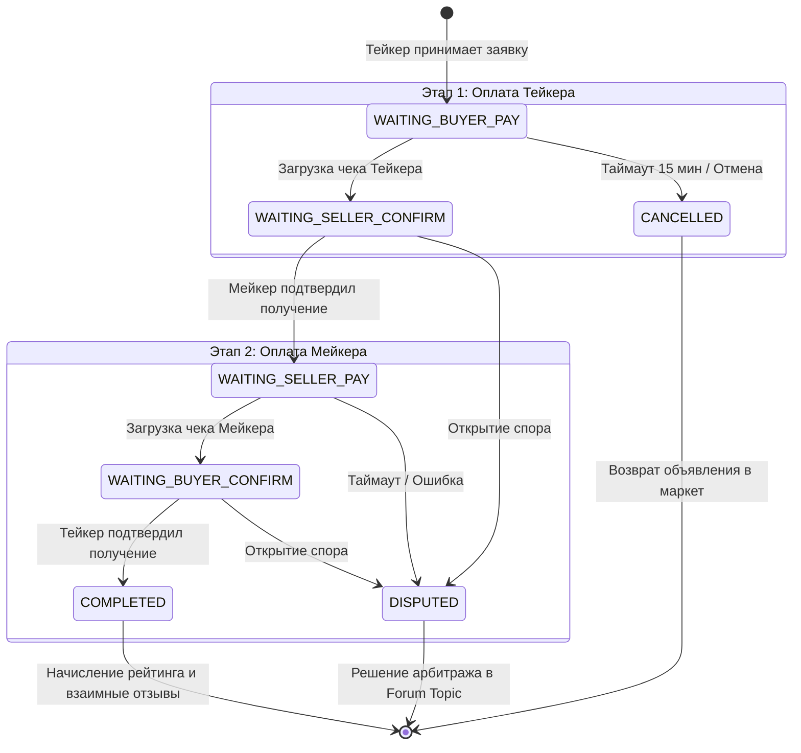
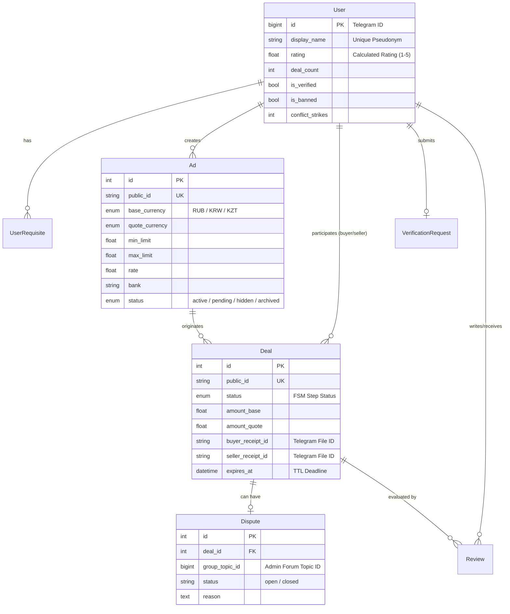

# 💱 Non-Custodial P2P Exchange Telegram Bot

[](https://python.org)
[](https://docs.aiogram.dev)
[](https://docs.sqlalchemy.org)
[](https://postgresql.org)
[](https://alembic.sqlalchemy.org)
[](https://docker.com)

Высоконагруженный некастодиальный P2P-обменник фиатных валют (RUB / KRW / KZT) в Telegram с двусторонней двухфазной верификацией сделки, системой арбитража на базе Telegram Forum Topics и фоновым контролем таймаутов (TTL).

---

## 🌟 Ключевые архитектурные решения

* **Некастодиальная модель (Zero-Custody):** Бот не депонирует средства пользователей, исключая риски блокировок счетов и регуляторные риски. Безопасность обеспечивается репутационной системой, обязательной фиксацией платежных квитанций и арбитражем.
* **Двухфазная модель обмена (Two-Phase Cross-Settlement):** Поддержка полного цикла взаиморасчетов между Тейкером и Мейкером с фиксацией встречных чеков (`buyer_receipt_id` и `seller_receipt_id`).
* **Арбитраж через Telegram Forum Topics:** При открытии спора или заявки на верификацию бот автоматически создает изолированный топик (`group_topic_id`) в супергруппе модераторов, организуя двусторонний мост связи между админами и участниками.
* **Repository Pattern:** Полная изоляция бизнес-логики и хендлеров от SQL-запросов через специализированные репозитории (`user_repo`, `deal_repo`, `ad_repo` и др.).
* **Фоновый TTL-воркер (Deal Timeout Worker):** Асинхронный шедулер (`APScheduler`) для автоматической отмены просроченных этапов сделки (15 мин) и возврата объявлений в маркет.
* **Приватность и безопасность:** Анонимизация пользователей через систему псевдонимов (`pseudonym_service`), встроенные middleware защиты контекста (`deal_guard`, `clean_chat`).

---

## 🏗️ Архитектура системы и жизненный цикл сделки

### 1. Finite State Machine сделки (2-Phase Settlement)



---

### 2. Схема базы данных (Entity-Relationship)



---

## 📂 Структура проекта

```text
p2p_exchange/
├── migrations/             # Миграции базы данных (Alembic)
├── src/
│   ├── bot/
│   │   ├── handlers/       # Обработчики Telegram (Market, Deals, Dispute, Admin)
│   │   ├── keyboards/      # Inline и Reply клавиатуры
│   │   ├── middlewares/    # Middleware (Auth, DealGuard, CleanChat)
│   │   ├── states/         # Состояния FSM
│   │   └── utils/          # Хелперы UI и форматирования
│   ├── core/
│   │   ├── config.py       # Pydantic Settings конфигурация
│   │   └── constants.py    # Константы системы
│   ├── database/
│   │   ├── models/         # Декларативные модели SQLAlchemy 2.0
│   │   ├── repository/     # Data Access Layer (Repository Pattern)
│   │   └── session.py      # Управление асинхронными сессиями
│   ├── services/           # Бизнес-логика (Шедулер, Воркер таймаутов, Псевдонимы)
│   └── main.py             # Точка входа приложения
├── docker-compose.yml      # Оркестрация сервисов (Bot + PostgreSQL)
├── Dockerfile              # Мультистейдж сборка контейнера
└── requirements.txt        # Зафиксированные зависимости
```

---

## 🚀 Быстрый старт (Deployment)

### 1. Клонирование и настройка переменных окружения

```bash
git clone https://github.com/Curr3ncyV01D/p2p_exchange.git
cd p2p_exchange
cp .env.example .env
```

Заполните `.env` вашими данными:
```env
BOT_TOKEN=your_telegram_bot_token
DATABASE_URL=postgresql+asyncpg://postgres:postgres@db:5432/p2p_db
ADMIN_SUPERGROUP_ID=-1001234567890
```

### 2. Запуск через Docker Compose

```bash
docker compose up -d --build
```

Система автоматически применит миграции Alembic, запустит базу данных и активирует фоновые воркеры.

---

## 🛠️ Стек технологий

* **Фреймворк:** `aiogram 3.x` (Asyncio, FSM, Middlewares)
* **База данных:** `PostgreSQL 15+`
* **ORM:** `SQLAlchemy 2.0` (Async Engine, Mapped Columns)
* **Миграции:** `Alembic`
* **Фоновые задачи:** `APScheduler`
* **Контейнеризация:** `Docker`, `Docker Compose`
